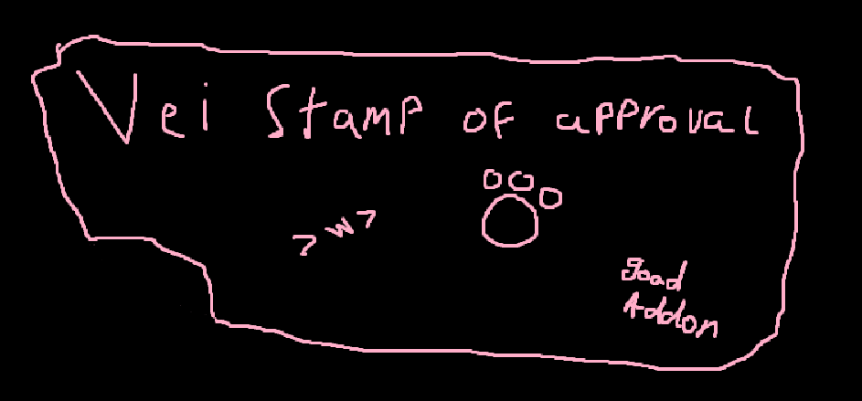

# EBC - EmeryBC

A [Bondage Club](https://www.bondageprojects.com/) addon by **Emery** - outfits, action buttons, expression presets, toys integration, friends management, poses, scenes, palettes, and a bunch of quality-of-life tools packed into a sliding drawer on the right side of the chat screen.

---

## Installation

### Tampermonkey / Violentmonkey

1. Install [Tampermonkey](https://www.tampermonkey.net/) or [Violentmonkey](https://violentmonkey.github.io/)
2. Click your channel to install:
   - **Stable** → [Install EBC](https://raw.githubusercontent.com/NekoEmery/EmeryBC/master/loader.user.js)
   - **Dev** → [Install EBC (dev)](https://raw.githubusercontent.com/NekoEmery/EmeryBC/dev/loader-dev.user.js)
3. Confirm the install prompt
4. Load Bondage Club - the EBC drawer appears on the right side of the chat screen

### FUSAM

EBC is listed in the [FUSAM](https://gitlab.com/Sidiousious/bc-addon-loader) addon registry. Install FUSAM and enable **EBC** from the addon list. Both stable and dev channels are available.

---

## Channels

| Channel | Bundle | Updated on |
|---------|--------|------------|
| **Stable** | [nekoemery.github.io/EmeryBC/stable/bundle.js](https://nekoemery.github.io/EmeryBC/stable/bundle.js) | Push to `master` |
| **Dev** | [nekoemery.github.io/EmeryBC/dev/bundle.js](https://nekoemery.github.io/EmeryBC/dev/bundle.js) | Push to `dev` |

Builds are deployed automatically via GitHub Actions on every push.

---

## Feature Overview

- [🎽 Outfits](#-outfits)
- [⛓️ Restraint Sets](#️-restraint-sets)
- [🔘 Action Buttons](#-action-buttons)
- [😊 Expression Presets & Chat Triggers](#-expression-presets--chat-triggers)
- [💬 Buttons & Toggles](#-buttons--toggles)
- [🛡️ Anti-Restraint](#️-anti-restraint)
- [🧍 Poses & Animations](#-poses--animations)
- [🎨 Palettes & Colors](#-palettes--colors)
- [🎬 Scenes](#-scenes)
- [👥 Users & Friends](#-users--friends)
- [📝 Notes](#-notes)
- [🌐 People Met](#-people-met)
- [🪆 Toys](#-toys)
- [🛠️ Dev Tools](#️-dev-tools)
- [🖼️ Drawer Appearance](#️-drawer-appearance)
- [✨ Quality of Life](#-quality-of-life)
- [🎓 Tutorial](#-tutorial)
- [💌 Feedback & Bug Reports](#-feedback--bug-reports)
- [⌨️ Slash Commands](#️-slash-commands)

---

## 🎽 Outfits

Save full outfit sets and load them with a custom `/command` in chat.

**Creating an outfit**
1. Dress your character how you want
2. Open the EBC drawer → **Outfits** tab
3. Fill in a command (e.g. `dom`), display name, and optional announce text
4. Click **+ Save Current Appearance as New Outfit**

**Using an outfit** - type `/dom` (or whatever command you set) in chat. The outfit loads instantly and sends the announce emote to the room.

**Per-outfit options**
- **Preserve restraints** - keep whatever restraints you're wearing when loading; off = swap restraints too
- **Preserve clothing** - keep current clothing layers when loading a restraint-focused outfit
- **Announce text** - emote sent to the room on load, e.g. `switches into dom mode`
- **Nickname / Title override** - automatically change your displayed name and title when the outfit loads
- **Expression preset** - link a face preset so your expression changes automatically when the outfit loads
- **Outfit tags** - colour-coded labels to organise outfits (e.g. "casual", "formal", "scene")

**Other outfit tools**
- **Save Current** - overwrite an existing outfit with your current appearance
- **Export / Import** - share outfits as JSON or load from a BC outfit code
- **Reorder** - move outfits up/down in the list

---

## ⛓️ Restraint Sets

Separate from outfits - save and apply restraint-only presets without touching clothing.

Same options as outfits: command, display name, announce text, tags, reorder, export/import.

---

## 🔘 Action Buttons

Up to 20 configurable quick-action buttons drawn on the side of the chatroom. The sidebar is draggable and collapsible.

Each button sends an action or emote to the room when clicked.

**Per-button settings**
- **Label** - up to 16 characters, displayed on the button (text is auto-scaled to fit)
- **Hex color** - custom background colour per button
- **Action text** - what comes after your name, e.g. `waves goodbye`
- **Style** - `action` `( )`, `emote` `* *`, or `sequence` (pipe-separated multi-step)
- **Expression preset** - optionally fire a face preset alongside the action, with an optional revert timer
- **Name in announce** - include or exclude your name from the message (action style only)
- **Enable / disable** toggle

**Sequences** - pipe-separate multiple steps to chain poses and messages with delays. Steps can be pose names, `!action text`, `*emote text`, or `leaveroom`.

**Categories** - group buttons into named tabs and switch between them with the arrow chips on the sidebar. Each category has its own set of buttons and slot count.

---

## 😊 Expression Presets & Chat Triggers

Save your facial expressions as named presets and apply them instantly.

### Expression Presets

1. Use BC's face controls (the face icon in the top menu) to set blush, eyes, mouth etc.
2. Open EBC → **Anims** tab → **Expressions** section
3. Type a name and click **💾 Save face**

**Managing presets**
- **Apply** - restore that face immediately
- **Update** - overwrite the preset with your current expression
- **Default** - mark one preset as your default face
  - The **↺ Reset face** button always jumps back to the default
  - Enable **Auto-apply on room join** so your default face loads automatically every time you enter a room

**Using presets elsewhere**
- Link a preset to an **outfit** - the face changes when you load the outfit
- Add a preset step to an **action button** - the face fires when you press the button (with optional revert timer)
- Use presets inside **expression sequences** - chain multiple face changes with delays
- Trigger presets automatically with **Chat Triggers**

### Chat Triggers

Automatically apply a face preset when your outgoing chat message contains a match phrase.

1. Open EBC → **Anims** tab → **Expressions** section → **＋ New Trigger**
2. Fill in:
   - **Contains** - the phrase that fires it (case-insensitive, e.g. `>:3`, `>_<`)
   - **Apply** - which preset activates
   - **Hold** - how long the face stays before reverting (0 = keep forever)

Type the phrase naturally in chat and the face swaps with it instantly. Works on actions, emotes, and regular chat messages.

---

## 💬 Buttons & Toggles

Found in the **Buttons** tab of the EBC drawer.

| Toggle | What it does |
|---|---|
| **OOC Mode** | Prefixes every chat message with `(` so it reads as out-of-character. Commands, emotes, and already-OOC messages are never modified. |
| **Safeword** | One-click safeword button that sends your configured safeword to the room. Set the word in the Settings panel. |
| **AFK Auto-Reply** | Sends a custom beep reply when someone messages you after X minutes of inactivity (default 10 min). 30-minute cooldown per sender to avoid spam. |
| **Beep Mute** | Silences all incoming beeps globally. |
| **Suppress Native Beep** | Stops plain beeps from also showing in BC's main chat log when EBC's IM handles them. |

**Per-person beep muting** - inside any IM / beep conversation window, tap the 🔔 icon in the header to mute that specific person. Tap again (🔇) to unmute. Session-only.

---

## 🛡️ Anti-Restraint

Automatically remove any restraint applied to you by someone else.

- Toggle on/off from the **Buttons** tab
- **Protected Items** - items on the whitelist are always kept, even if applied by others. Add items from the settings panel.
- **Confirm dialog** - shows a prompt before auto-escaping so you can choose to accept the restraint
- Covers all restraint slots including collar and neck
- Retries removal up to 2 times per slot before giving up on locked items
- Sends a glare emote to the room after a successful escape

---

## 🧍 Poses & Animations

Quick-access pose combo buttons - apply a full set of BC poses in one click.

- Create named combos from any combination of BC poses
- Apply combos from the drawer or define a slash command for each
- Edit and delete combos

**Expression sequences** - chain multiple face presets together with configurable delays per step. Assign a `/command` name and trigger them from chat. Useful for animated facial reactions.

---

## 🎨 Palettes & Colors

Save and reapply color schemes across your character.

- **Outfit palettes** - capture your current outfit colors and restore them later
- **Restraint palettes** - same for restraint-slot items
- **Custom color library** - save individual hex colors as swatches for quick access
- **Apply to group** - paint a single color across all zones of a body group
- **Restraint presets** - save a restraint color configuration and reapply it to matching items

---

## 🎬 Scenes

Scripted multi-step sequences you can trigger with a slash command.

**Step types**
- **Emote** - send a `/me` action to the room
- **Outfit** - load one of your saved outfits
- **Restraints** - apply a restraint set
- **Pose** - apply a pose combo
- **Delay** - wait N seconds before the next step

Build scenes in the **Scenes** tab, assign a command, and run them with `/yourcommand` in chat. Export and import scenes as JSON.

---

## 👥 Users & Friends

The **Users** tab has three sections.

### People in Room
Collapsible panel showing everyone currently in the chat room:
- Green presence dot, name (nickname if set), member number
- Relationship badge (Owner, Lover, etc.)
- EBC version badge (if they're running EBC)
- Friend tags
- **Profile** button - opens the BC information sheet
- **Beep** button - opens the EBC IM window (friends only)
- **Copy ID** button - copies the member number to clipboard

### Friends List
Your BC friends list with expandable rows. Click a friend row to expand:

- 🤝 **Friends since** date
- 🕑 **Last seen** timestamp (tracked across sessions)
- **Tags** - add custom colour-coded labels (e.g. "dominant", "close friend")
- **Note** - inline text editor for personal notes. Auto-saves 800ms after you stop typing
- **📌 Pin** - pin a friend to the top of the list

Friends are sorted: pinned first → alphabetical. Unread beep badge shows on the friend row.

### Outfit Schedules
Set an outfit to auto-apply at a specific time of day. Schedules run when you're logged in and the time matches.

---

## 📝 Notes

The **User Notes** tab shows all characters you've written notes about, with an expandable editor per person. Notes auto-save and sync server-side so they're available across devices.

Notes can also be written directly from the Friends list expand panel without switching tabs.

---

## 🌐 People Met

Everyone you've ever shared a room with - saved server-side and synced across devices. Capped at 2 000 entries (oldest evicted first).

- Browse in the **People Met** section of the Users tab
- Includes name, member number, and a Profile button
- Use **Clear list** to wipe all entries

---

## 🪆 Toys

Found in the **Toys** tab of the EBC drawer. Split into Game Toys (in-BC mechanics) and IRL Toys (hardware integration).

### Game Toys

Control the BC vibrator system from EBC.

- **Enable / Disable** - master toggle for the BC vibrator item interaction
- **Vibrator mode** - choose Tease, Deny, Orgasm, or Edge to set the toy's behavior pattern
- **Privacy** - hide game-toy activity from other room members
- **Whitelist** - restrict who can interact with your BC toys to a list of specific member numbers

### IRL Toys / Lovense

Connect a real Lovense toy so it responds to BC events. Two connection paths are supported:

**BLE Direct** - use the Lovense browser extension or app to connect over Bluetooth from the same browser tab.
- Click **Connect Toy** to scan and pair a nearby Lovense device
- Set intensity and duration per device with the sliders

**HTTP (Lovense App)** - connect via the Lovense mobile app's local HTTP server.
- Enter your Lovense app HTTP URL in the field
- Click **Test Connection** to verify the link before using it
- Individual toys in the list each have their own intensity and duration sliders and a test button

Both modes respond to BC arousal and vibrator events in real time.

---

## 🛠️ Dev Tools

Found in the **Dev** tab (bottom of the drawer).

### EBC Users in Room
Lists all room members currently running EBC and their version number.

### Copy Restraints from Member
Copy another room member's current restraints onto yourself.
- Select a member from the dropdown
- Preview which restraints will be copied before confirming
- Lock data is stripped - you own the items freely
- Only the copied slots are replaced; your other restraints are untouched

### Character Inspector
Dump raw appearance and property data for any room member - useful for debugging item states, craft names, and property values.

### Addons Loaded
Lists all `bcModSdk` mods currently active in the session, with their version and hooked functions.

### Logs

| Log | What it records |
|---|---|
| **Rooms Visited** | Room names, join/leave timestamps, time spent per room. Opt-in. |
| **Restraint Log** | Every restraint added or removed from your character, with who did it and when. Opt-in. |
| **Message Log** | Recent chat messages from the current session. |

---

## 🖼️ Drawer Appearance

Customisation options found in the **Dev** tab under *Drawer Appearance*.

| Setting | What it does |
|---|---|
| **Colour theme** | Choose from Default (Pink), Purple, Blue, Green, Red, or Dark (Mono). |
| **Tab visibility** | Hide tabs you never use. |

---

## ✨ Quality of Life

**Overhead EBC badge** - broadcasts a small `EBC` tag above your character's head to other EBC users. Optionally show your version number. Both toggleable from Settings.

**IM / Beep window** - threaded beep conversations with message history, unread badges, timestamps, and per-person mute (🔔/🔇) per person.

**Timers** - passive counters in the drawer:
- ⏱ Time online this session
- 🚪 Time in current room
- ⛓ Time wearing current restraints

**Update notifications** - EBC checks GitHub for a newer version 30 seconds after load, then every hour. Silence with `/ebc updates off`.

---

## 🎓 Tutorial

EBC includes a built-in guided tour. Click **Tutorial** in the EBC footer to open the mode selector.

Two modes to choose from:

| Mode | Steps | What it covers |
|---|---|---|
| **Quick Tour** | 6 | Core features - new outfit, load outfit, action buttons, expressions, drawer appearance, version info |
| **Full Guide** | 13 | Everything in the Quick Tour plus friends, notes, anti-restraint, scenes, palettes, and more |

Each step spotlights the relevant UI element and explains what it does. Advance at your own pace with the Next button, or close the guide at any time.

---

## 💌 Feedback & Bug Reports

Click **Feedback & Bugs** in the EBC footer to submit a report without leaving the game.

- **Type** - Bug report, Feature request, or Other
- **Summary** - what happened or what you'd like
- **Steps / detail** - reproduction steps, context, or extra info

Reports are submitted anonymously via a Google Form. Your EBC version and member number are attached automatically to help with debugging. You never leave the game - the form submits in the background and shows a confirmation toast when done.

---

## ⌨️ Slash Commands

| Command | Aliases | What it does |
|---|---|---|
| `/ebc` | | Show all available commands |
| `/ebc version` | `/ebc ver`, `/ebc v` | Print current EBC version |
| `/ebc changelog` | `/ebc changes` | Show recent version history in local chat |
| `/ebc release` | `/ebc free` | Remove all non-protected restraints from yourself |
| `/ebc unlock` | | Remove all non-owner/lover locks from your items |
| `/ebc ameter` | `/ebc arousal`, `/ebc lust` | Toggle the arousal/lust meter |
| `/ebc update` | `/ebc check` | Manually check GitHub for a newer version |
| `/ebc updates on` | | Re-enable automatic update notifications |
| `/ebc updates off` | | Silence automatic update notifications |

Outfit, restraint set, pose combo, and scene commands are defined per-item in their respective editors.

---

## Credits

The sliding drawer UI was inspired by **[CRABS](https://github.com/sin-1337/CRABS)** by **Sin** - thank you for the open design! ♥

---

## License

[MIT](LICENSE) - © Emery

---

## 🐾 Stamps of Approval

*Want your stamp here? Find Emery in-game at the **EmeryBC HQ** room and ask her! ♥*

  w7" width="420">

